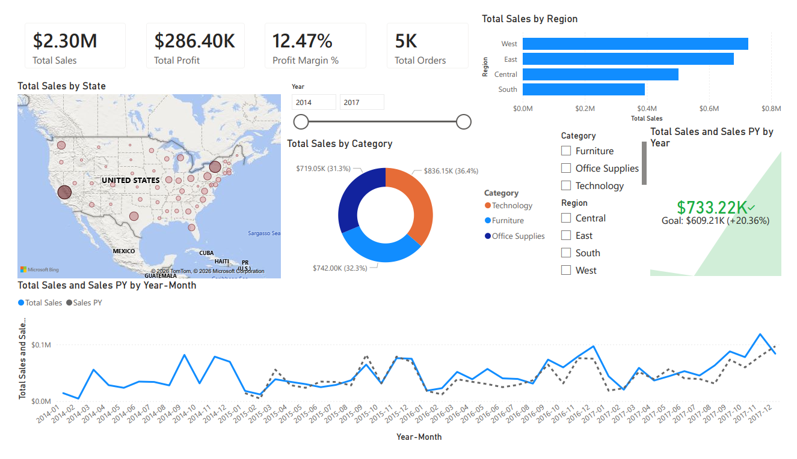
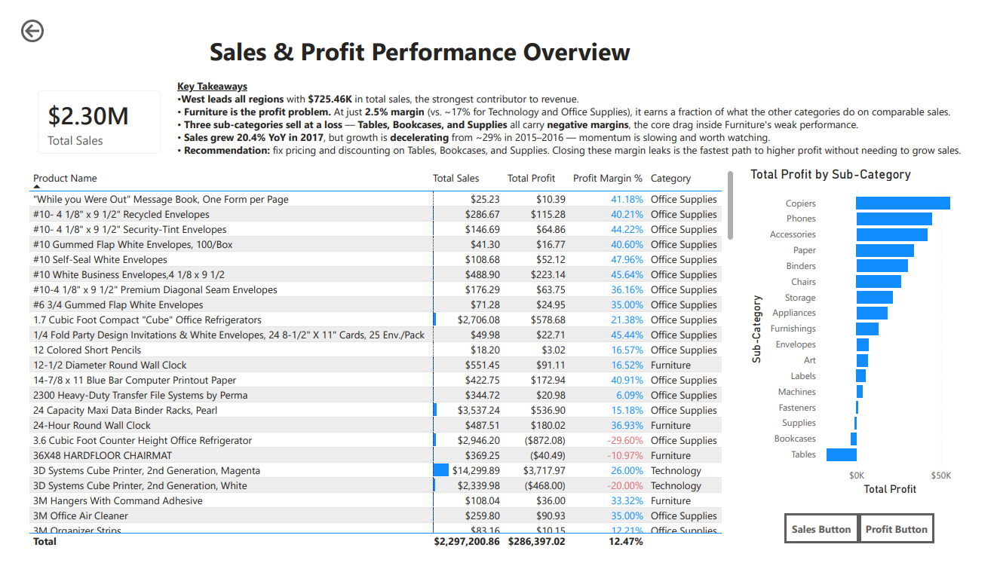

# Sales Executive Dashboard (Power BI)

An interactive, multi-page Power BI dashboard analyzing sales, profit, and regional performance for executive decision-making — built with **DAX time-intelligence**, **drill-through**, **bookmarks**, and **conditional formatting**.

---

## Business question

*Where is revenue and profit growing or leaking, and which regions, categories, and products should leadership focus on?*

## Data

**Sample Superstore** — ~10,000 retail orders spanning 2014–2017, with order dates, regions, categories, sub-categories, products, sales, and profit. The order-level dates make it ideal for time-intelligence analysis.

## Tools & techniques

`Power BI Desktop` · `DAX` · star-schema data modeling

- **Date dimension** built in DAX and marked as a date table, enabling all time-intelligence
- **Time-intelligence measures:** Prior Year (`SAMEPERIODLASTYEAR`), YoY %, YTD (`TOTALYTD`), MoM %, and a 3-month rolling average
- **Drill-through** from the overview to a filtered product-detail page
- **Bookmarks** powering a Sales ⇄ Profit toggle
- **Edit interactions** to control cross-filtering between slicers and visuals
- **Conditional formatting** (data bars, red flags for negative margins)

---

## Key findings

- **West leads all regions** with **$725K** in total sales — the strongest revenue contributor.
- **Furniture is the profit problem.** At just **2.5% margin** (vs. **17.4%** for Technology and **17.0%** for Office Supplies), it earns a fraction of what the other categories do on comparable sales.
- **Three sub-categories sell at a loss** — **Tables, Bookcases, and Supplies** all carry **negative profit margins**, the core drag inside Furniture's weak performance.
- **Sales grew 20.4% year-over-year in 2017**, but growth is **decelerating** — down from ~29% in 2015–2016. Momentum is slowing and worth monitoring.

## Recommendation

Review pricing and discounting on **Tables, Bookcases, and Supplies**. Eliminating these margin leaks is the fastest path to higher profit **without needing to grow sales** — a higher-leverage move than chasing additional top-line revenue while loss-making products erode the gains.

---

## Dashboard pages

**Executive Overview** — KPI cards (Sales, Profit, Margin %, Orders), a current-vs-prior-year trend line, and sales breakdowns by region, state, and category, with interactive slicers.

**Product Detail** (drill-through target) — product- and sub-category-level sales, profit, and margin, with conditional formatting that flags loss-making products in red.

---

## Files in this repo

- `sales-executive-dashboard.pbix` — the Power BI file (open in Power BI Desktop)
- `executive-overview.png` / `product-detail.png` — dashboard screenshots
- PDF export of the full dashboard

## What this project demonstrates

Power BI data modeling, **DAX time-intelligence (YoY, YTD, MoM, rolling averages)**, KPI development, **drill-through and bookmarks**, conditional formatting, controlled cross-filtering, and translating a dashboard into a clear business recommendation.
